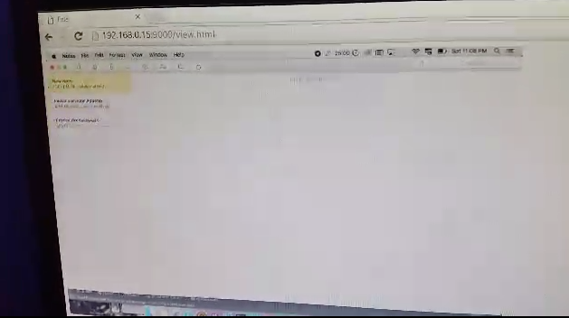

# ksv-trixlogger
KSV Trixlogger é um aplicativo para controle remoto de maquinas rodando sistema operacional OSX

# Bloco de informação

A estrutura de cada bloco de informação, contido no arquivo de saída (log) possui a seguinte estrutura:

`[ id : parâmetros [ texto ]]`

- Encapsulamento em `[` `]` determina o inicio e fim de cada bloco de informação;
-  O primeiro caractere de todo bloco é o `id` do bloco, que indica qual o tipo do evento capturado e consequentemente determina o restante da estrutura de parâmetros. ( um caractere seguido de um `:`);
- Os blocos podem conter N parâmetros ( separados por `:` ) ou um parâmetro do tipo *lista*, que é constituido de uma série de dados separados por um `|` pipe;
- Todo bloco de anuncio *pode* possuir uma informação genérica, livre de formatação (texto livre ou estruturado em alguns casos, veja a tabela *tipos de blocos de informação*), e possue um espaço específico dentro de cada bloco, que é no *final* do bloco antes do fechamento, também encapsulado por `[` `]`.

`[{  [ id : parâmetros [ texto ]]  [ id : parâmetros [ texto ]] ...  }]`

- Encapsulamento de vários blocos de informação delimitados por `[{` `}]`, indicam um grupo de blocos combinados. Para eventos de teclado um grupo de blocos é o registro de combinações de teclas modificadoras, por exemplo. `SHIFT + a`, para deixar a letra `a` maíuscula.

- - - 

#Tipos de blocos de informação/evento

## Header
#### Bloco único de informação contendo dados estáticos, de hardware ou software.

Este é o único bloco de informação composto, por vários blocos de informação.

O cabeçalho (header) usa delimitadores diferentes dos blocos de informação normais, é usado `[~` `~]` no lugar.

## Mouse
#### Blocos de informação para eventos de Mouse

|  ID |  Resumo     |  Descrição e dados contidos |
|:--------------:|------------|-----------------------------|
|      c:        |   Indica um evento de CLICK | - O primeiro atributo é o estado do clique, realizado pelo usuário, 1 para clique simples, 2 para clique duplo, 3 para clique triplo, etc....    - O segundo atributo contém as cordenadas X e Y do mouse, no momento da captura do clique ( separados por `x` ). *Importante:* o valor de X ou de Y podem ser *negativos* se o usuário estiver usando dois monitores, por conta do alinhamento.   - O Terceiro parâmetro é um texto que informa qual é o botão do mouse usado |
|      d:        |   Indica um evento de CLICK AND DRAG | - Contém uma lista de cordenadas (x,y) (separados por `|` pipe)    - O Segundo parâmetro é um texto que informa qual é o botão do mouse usado para clicar e arrastar.

## Keyboard
#### Blocos de informação para eventos de Teclado

|  ID |  Resumo     |  Descrição e dados contidos |
|:--------------:|------------|-----------------------------|
|      m:        |   Indica uma tecla de função | - No bloco de texto livre, está o nome da tecla pressionada. |
|      k:        |   Indica uma tecla qualquer do teclado (exceto de função) | - No bloco de texto esta a tecla pressionada, já com conversão aplicada em casos de combinação  shift + a, o valor do bloco de texto será `A`, por exemplo.

*NOTA:* Quando uma tecla modificadora ( command, shift, control, option/alt, etc... ) é ativada, todos os blocos referentes a eventos de Teclado, serão gravados/transmitidos em forma de grupo de bloco, delimitados por `[{` `}]`.

*NOTA 2:* Toda tecla modificadora, é gravada duas vezes dentro do grupo de blocos, a primeira ocorrência representa o momento em que a tecla foi pressionada, e a segunda ocorrência representa quando a tecla é solta, até que a primeira tecla modificadora seja solta, e então o grupo é fechado.

*NOTA 3:* A tecla modificadora `CAPS LOCK` não se aplica ao grupo de blocos de teclas modificadoras, o evento é registrado com um bloco simples: `[m:[caps-on]]` ou `[m:[caps-of]]`, dependendo do estado do `CAPS LOCK`.

## Clipboard
#### Blocos de informação para rastreio de area de transferência

|  ID |  Resumo     |  Descrição e dados contidos |
|:--------------:|------------|-----------------------------|
|      t:        |   Armazena o valor capturado da area de transferência | - Não possui parâmetros, apenas o bloco de texto entre `[` `]`. O conteúdo dentro desse bloco é o que foi capturado da area de transferência do usuário, e esta codificado em base64, para garantir integridade do que foi capturado. |

*NOTA:* Quando o KSV é iniciado, e a area de transferência do usuário não estiver vazia, o primeiro evento registrado é o que esta na area de transferência.

## Terminal
#### Blocos de informação para comandos de terminal

### TODO

## Screen
#### Blocos de informação para rastreio/eventos de tela

### TODO

## Process
#### Blocos de informação para observação de status de processos em execução

### TODO

- - - -

# Exemplo de blocos

- `[~[s:[1280x800]][v:[10.11.15]]~]`
    - Bloco de cabeçalho, é único e contém informações sobre o computador destino. E informa a resolução total e a versão do sistema operacional.

- `[c:1:1430.18x188.0664[left-click]]`
    - Este bloco indica um evento de clique simples com o botão esquerdo do mouse, na tela do usuário nas cordenadas 1430 x 188.

- `[d:1432.18x-78.0664|1438.12x-78.0664|1446.3x-78.0664|1461.16x-78.0664|1478.26x-78.0664|1493.13x-78.0664|1503.54x-78.0664[left-drag]]`
    - Este bloco indica um evento de clicar e arrastar usando o botão esquerdo do mouse, possue uma lista de cordenadas X e Y percorridas pelo mouse durante o "arrastar".

- `[t:[T2xhIE11bmRvLCBCZW0gVmluZG8gYW8gS1NW]]`
    - Este bloco indica que um texto foi capturado da area de transferência, e esta codificado em base64.

- `[k:[a]]`
    - Este bloco indica uma tecla pressionada pelo usuário uma única ves (não esta no modo de repetição)

- `[{[m:[left-cmd]][k:[a]][m:[left-cmd]]}]`
    - Este bloco indica que a combinação de teclas `COMMAND + A` foi realizada pelo usuário.

- - - -

# Testes em vídeo

- [Teste 01 - Dia 11/06/2016](https://www.youtube.com/watch?v=ZPClaOJVuoY)

